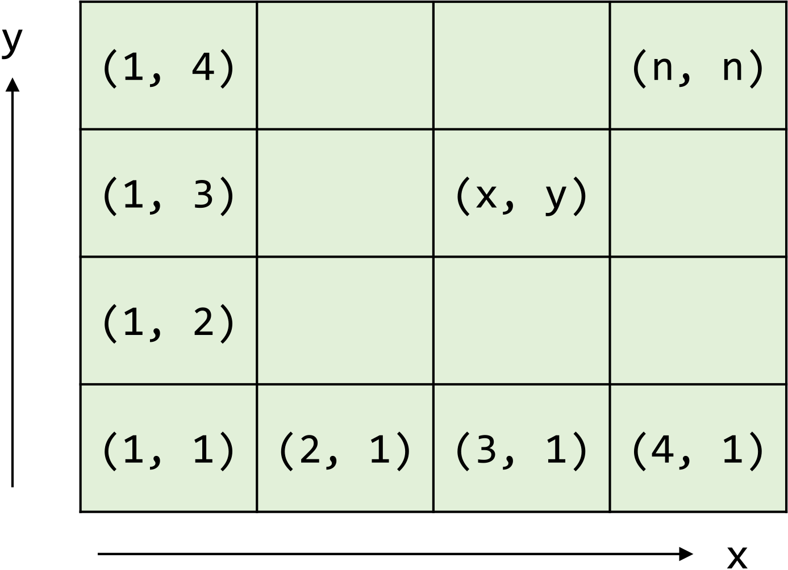
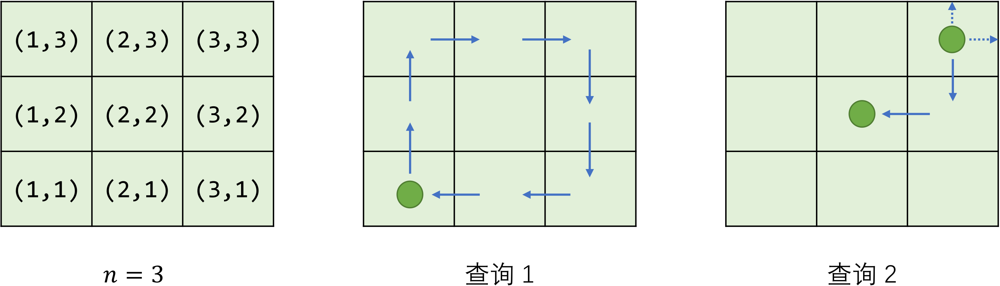

时间限制： 1.0 秒  
空间限制： 512 MiB  
相关文件： 题目目录  
## 题目背景  
西西艾弗岛某山脉深处出土了一台远古机器人，具体年代已不可考。初步修缮后，研究人员尝试操控机器人进行些简单的移动。
## 题目描述
整个实验场地被划分为 n×n 个方格，从 (1,1) 到 (n,n) 进行编号。机器人只能在这些方格间移动，不能走出场地范围。

假设机器人当前位于 (x,y)，那么接下来可以向前后左右任意方向移动一格：
- 向前移动 f：(x,y)→(x,y+1)
- 向后移动 b：(x,y)→(x,y−1)
- 向左移动 l：(x,y)→(x−1,y)
- 向右移动 r：(x,y)→(x+1,y)  
特别地，如果移动的目标位置不在场地范围内，则机器人位置保持不变。这样，使用由 f、b、l 和 r 组成的指令序列便可操纵机器人在场地上自由移动。试处理 k 个查询：每个查询包含一个机器人起始位置 (x,y)（1≤x,y≤n）和一个移动指令序列（由 fblr 四个字母组成的字符串），输出执行完移动指令后的最终位置。
## 输入格式
从标准输入读入数据。

输入的第一行包含空格分隔的两个正整数 n 和 k，分别表示场地大小和查询个数。  
接下来 k 行：每行包含空格分隔的两个正整数 x、y 和一个由 fblr 四个字母组成的字符串，表示一个查询。
## 输出格式
输出到标准输出。  
每个查询输出一行：包含空格分隔的两个正整数 x 和 y，表示对应查询的最终位置。
## 样例输入
3 2  
1 1 ffrrbbll  
3 3 frbl  
## 样例输出
1 1  
2 2
## 样例解释

子任务50 的测试数据满足：指令序列不会试图将机器人移出场地（即无需考虑场地边界，如样例中的查询 1）；  
全部的测试数据满足：n、k 和每个指令序列的长度均大于 0 且不超过 100。