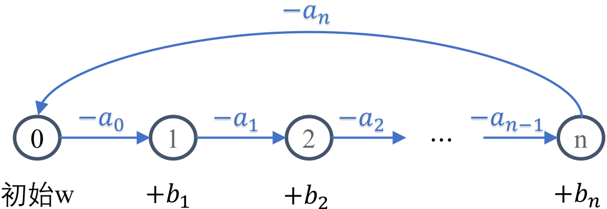

时间限制：1.0秒  
刷新  
空间限制：512MiB  
相关文件：题目目录

## 题目背景
传说每当月光遍布西西艾弗岛，总有一道身影默默守护着居民们的美梦。

## 题目描述
梦境中的西西艾弗岛由 $ n + 1 $ 个区域组成。梦境巡查员顿顿每天都会从梦之源（0号区域）出发，顺次巡查 1, 2, \ldots, n 号区域，最后从 n 号区域返回梦之源。

在梦境中穿梭需要消耗美梦能量：
- 从梦之源出发时，顿顿会携带若干初始能量；
- 从第 $ i $ 号区域前往下一区域（0 ≤ $ i $ ≤ $ n $）需要消耗 $ a_i $ 单位能量，因此从第 $ i $ 号区域出发时，顿顿剩余的美梦能量需要大于或等于 $ a_i $ 单位；
- 顺利到达第 $ i $ 号区域（1 ≤ $ i $ ≤ $ n $）后，顿顿可以从当地居民的美梦中汲取 $ b_i $ 单位能量作为补给。

假设顿顿初始携带 $ w $ 单位美梦能量，那么首先需要保证 $ w \geq a_0 $，这样顿顿便可消耗 $ a_0 $ 能量穿梭到 1 号区域、进而获得 $ b_1 $ 单位能量补给。巡查 1 号区域后，顿顿剩余能量为 $ w - a_0 + b_1 $，如果该数值大于或等于 $ a_1 $，顿顿便可继续前往 2 号区域。依此类推，直至最后消耗 $ a_n $ 单位能量从 $ n $ 号区域返回梦之源，便算是顺利完成整个巡查。西西艾弗岛，又迎来安宁的一夜，可喜可贺！

作为一个成熟的梦境巡查员，顿顿已经知晓初始需要携带多少能量可以保证顺利完成巡查。但在一些意外状况下，比如学生们受期末季的困扰而无法安眠，顿顿可能在某些区域无法采集足够的美梦能量。此时，便需要增加初始携带量以备万全。

具体来说，考虑一个简单的情况：在1到n号区域中，有且仅有一个区域发生意外，顿顿无法从该区域获得能量补给。如果第i号区域（1≤i≤n）发生意外（即bi变为0），则此时为顺利完成巡查，顿顿从梦之源出发所携带的最少初始能量记作w(i)。

试帮助顿顿计算w(1), w(2), …, w(n)的值。

### 输入格式
从标准输入读入数据。  
输入共三行。  
输入的第一行包含一个整数n。  
输入的第二行包含n+1个整数a0, a1, a2, …, an。  
输入的第三行包含n个整数b1, b2, …, bn。

### 输出格式
输出到标准输出。  
输出仅一行，包含空格分隔的n个整数w(1), w(2), …, w(n)。
### 样例1输入
```
3
5 5 5 5
0 100 0

```
### 样例1输出
```
10 20 10
```
### 样例1解释
1 和 3 号区域本身便没有补给，需要携带 10 单位初始能量抵达 2 号区域，获得 2 号区域的大量补给后便可顺利完成巡查；

2 号区域发生意外，则全程没有补给，初始需携带 20 单位能量。
### 样例2输入
```
3
9 4 6 2
9 4 6

```
### 样例2输出
```
15 10 9
```
### 子任务
80 的测试数据保证 0 < n ≤ 1000;

全部测试数据保证$ 0 < n ≤ 10^5$ 且 $0 ≤ a_i, b_i ≤ 1000$。